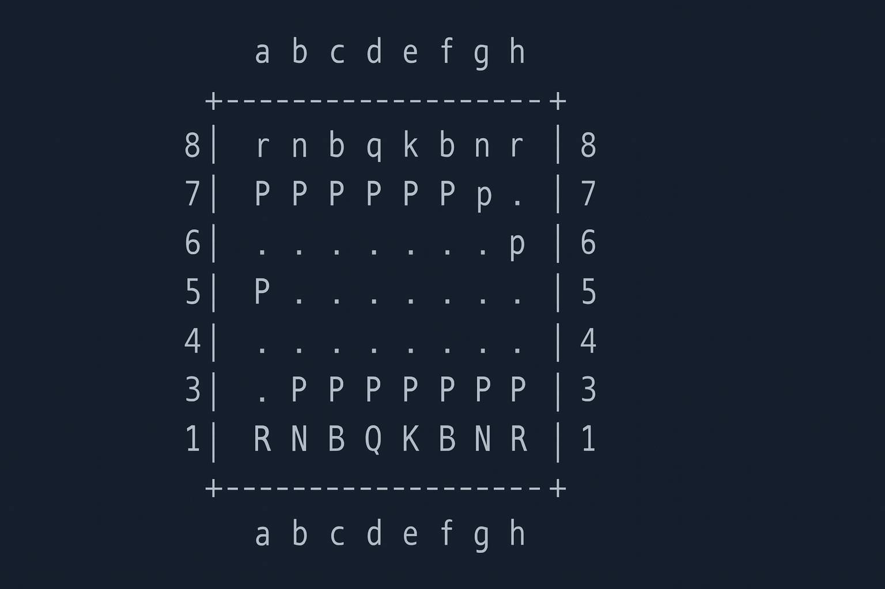

# Chess Bitboard Engine ♟️



## Overview
This project is a fully functioning **chess engine** built from scratch using **bitboards**.  
It supports all the rules of chess, including castling, en passant, and promotion, and features a **minimax search with alpha-beta pruning**.

The banner above shows an ASCII-style digital chessboard — a nod to how the game is represented internally in code.

---

## Features
- Full chess rules implemented
- Bitboard move generation with magic bitboards
- Minimax + alpha-beta pruning search
- Evaluation heuristics (material, piece-square tables, development, pawn pushes, safety)
- Perft testing for validation
- Playable in terminal (PvP and PvE)

---

## Usage
Run one of the following commands:

```bash
# 1. Perft Test (move generation validation)
python main_terminal.py

# 2. Play vs Engine (Human vs AI)
python player_vs_engine.py

# 3. Play PvP (Human vs Human)
python main_terminal.py
